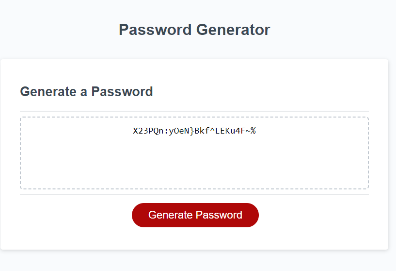

# George Ryder - Password Generator

## Description

This program is used to generate a random password based on criteria selected using prompts in JavaScript.

My motivation to complete this project was to gain a more intimate understanding of JavaScript through the buidling of a more complicated app with real-world uses. These were also the main factors behind building this project. Not only did I get familiar with some more complex JavaScript ideas such as functions and manipulation of data structures. I also built this program as I believe it solces some real world issues. In modern times, password security is a huge issue that comes up constantly. This program therefore enables you to generate a random password of any length whilst also allowing you to select certain criteria for a more secure password. This project was a big challenge for me and I learnt a lot through doing it. As mentioned, I learnt about data manipulation in further depth and I also learnt a lot about functions and where they are applicable in programming. One aspect that I struggled with initially was deciding on how to search through the arrays given the requirement conditions. In the end, I decided to base it off of if statements and the order in which the requirements were asked for. For future improvements, I believe this aspect could be done better so it is less reliant on hard written code. I also believe that this could be put into a function to make the JavaScript code read better; this may be something to revisit in the future. Overall, I learnt a lot on this project and believe it is a useful real-world application. However, I believe with greater experience in the future I will be able to come back to this project in the future and optimise it further with slightly less hard-coding and greater use of functions.

## Installation

Github repository: https://github.com/NotGeorgeHere/Password-Generator

Live Deployment Page: https://notgeorgehere.github.io/Password-Generator/

## Usage

 

## License
N/A
